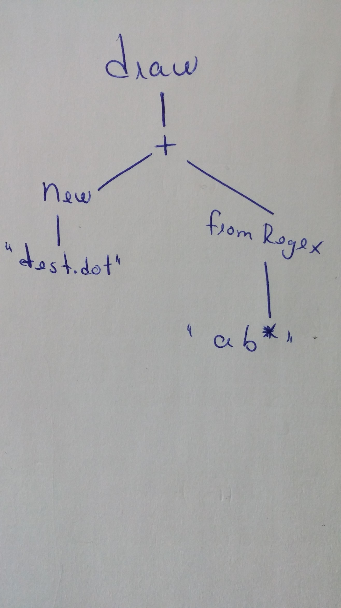

##Summary

Interpretador que lê automatos (de um ficheiro .dot ou expressão regulares) e efectua operações entre eles.
Permite verificar se um dado input é aceite pelo autómato.
Podemos também escrever o automato para um ficheiro .dot ou imprimir a sua representação gráfica.

##Análise Lexical

###TOKENS:

####Tokens com utilidade
OPEN : "("
CLOSE : ")"
STRINGDELIM : "\"">
END_STMT : ";">
ENDL : "\n"

####Identificadores:
FA : "FA" 				
SYM : (["A"-"Z","a"-"z"])(["0"-"9","A"-"Z","a"-"z"])* >
STRING: "\"" (~["\"","\n","\r",";","="])* "\""  >

####Operações com DFAs
|TOKEN                       | Descrição                     |
|----------------------------|-------------------------------|
|MUL : "x"	                 |	Multiplicação de dois DFAS   |	
|DOT : "."	                 |	Concatenação de dois DFAs    |
|REV : "rev"	             |	Reverse do DFA               |
|NOT : "not"                 |	Negação do DFA               |
|STAR : "star"               |	Operação STAR                |
|INT : "int"	             |	Interseção de dois DFAs      |		
|UN : "+"	                 |	União de dois DFAS           |
|XOR : "xor"	             |	Operação XOR                 |
|TODFA : "dfa"               |	Passa um NFA para DFA        |
|MIN : "min"	             |	Minimiza um DFA              |
|EQUAL : "="                 |  Atribuição                   |   

####Funções para DFAs
|TOKEN                   |Descrição                                           |
|------------------------|----------------------------------------------------|
|DUMP : "dump"	         |Guarda o automato num ficheiro ".dot"               |
|PRINT : "print"	     |Imprime na consola o automato                       |
|DRAW : "draw"	         |Imprime uma representação gráfica do automato       |
|NEW : "new"             |Cria um automato a partir de um ficheiro            |
|FROMREGEX : "fromRegex" |Cria um automato a parti de um uma expressão regular|

###Dificuldades

Não encontramos nenhuma dificuldade que se destaca-se

##Análise Sintática

###Gramática
S -> Stmt
Stmt -> (Decl) ? Expr0
Expr0 -> ("Assign") ? Expr
Expr -> Expr2 (BinOpTier1 Expr)?
Expr2 -> Expr3 (BinOpTier2 Expr2)?
Expr3 -> UnaryOp | SYM | OPEN Expr CLOSE | New | (Func)?
Func -> DOT DUMP OPEN STRING CLOSE
Assign -> SYM EQUAL
UnaryOp ->(REV | NOT | START | MIN | TODFA | PRINT | DRAW ) OPEN Expr0 CLOSE
New -> (NEW  | FROMREGEX ) OPEN STRING CLOSE
BinOpTier1 -> UnaryOp
BinOpTier2 -> MUL | DOT | INT | XOR
Decl -> FA SYM EQUAL

###Dificuldades
Tivemos dificuldades em manter o LOOKAHEAD = 1. Neste momentos temos isso em todo o lado excepto no operador "=",atribuição, onde tivemos que usar o LOOKAHEAD = 2.

##AST
###Exemplo
draw(New("test.dot") + fromRegex("ab*"));

###Dificuldades
Tivemos dificuldade em colocar da maneira que queríamos(com um número reduzido de Nodes)
